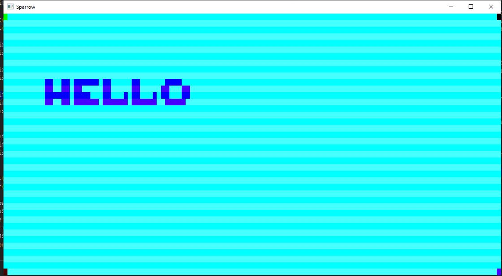

# Project Sparrow - Day Count

## 1. Jan 16, 2020 - Hello World

## 2. Jan 25, 2020 - Hello Window

## 3. Jan 26, 2020 - Callbacks and Messages

## 4. Feb 03, 2020 - Hello Mouse

## 5. Feb 07, 2020 - Code refactoring and bug hunting

## 6. Feb 23, 2020 - Work on the primary output buffer

## 7. Feb 26, 2020 - Back to handmade hero

## 8. Feb 27, 2020 - Debugging fake Bitmap info

## 9. Feb 29, 2020 - Back to 2018!

## 10. Mar 08, 2020 - Fighting Windows API

## 11. Mar 09, 2020 - Hunting for pointer loss bugs

After I tried to add some animation to my main buffer, I realized that my WinMain wasn't updating the animation. Moreover, if I removed the render loop from WM_PAINT, my render buffer would fail to render at all!

At that time, my code looked the following way (simplifying and stripping it down):

    MainMemory = Win32_MainMemoryInit(KiB(10)); // stored as global
    while (GlobalRunning){
        [...]
        UpdateState(MainMemory);
        Render(MainMemory)

        void* DeviceContext = GetDC(Window);
        rect WindowRect;
        GetClientRect(Window, &WindowRect);
        Win32_UpdateBuffer(DeviceContext, WindowRect);
        ReleaseDC(Window, DeviceContext);
    }

You'll notice that instead of HDC and RECT types I'm using a void \* and my own rect type. That's an experiment that I've been continuing - rewriting only the most essential to me pieces of Windows API, and leaving everything else barebones.

I quickly realized that I wasn't getting a proper Device Context inside my WinMain. GetDC(HWND) would just return null. So my first assumption was that my custom Windows calls were busted. I tried to reimplement (several times) proper HDC struct:

    typedef struct {
        int unused;
    } _HDC;
    typedef _HDC HDC;

I also tried to replace a void\* with a simple u32 or u64. To no avail.

Additional debugging showed that my Window handle would also become null! Moreover, after entering the loop above for the first time, it would quickly go from its normal pointer value to something like 0x0000000100010001, before eventually zeroing out completely. Something similar was happening to my DeviceContext, as well.

My searches led me to understand that something was happening inside the UpdateState() and Render() functions which were both getting MainMemory struct. Finally, isolating some code and by slowly releasing it I was able to find the culprit: the MainMemory allocation block!

The memory struct, as of now, is super simple:

    struct memory
    {
        memory_index Size;
        void* Data;
    };

And the code to initialize it was simple as well:

    local struct memory*
    Win32_MainMemoryInit(memory_index Size)
    {
        struct memory* Result =
            Win32_MemoryAlloc(Size + sizeof(struct memory));
            // Fancy wrapper to call VirtualAlloc
        Result->Size = Size;
        Result->Data = &Result + sizeof(struct memory);

        return (Result);
    }

And it's in the function above that a trained eye will immediately spot the bug: I was initializing Data to point not at the virtual space provided to me by Windows, but directly on the stack, a few bytes after the pointer itself! And, of course, back at the main loop that data was occupied by the Windows and, later, DC.

Removing the small & symbol was all it took! So much for hours of debugging spread accross two days.

## 12. Apr 12, 2020 - Implementing DLL loading (+getting rid of CRT)

I set myself on the road of casey's Hot Reloading(tm) today. The idea was to try and reimplement the dll loading system without peaking or otherwise trying to cheat my way out of it.

Challenge: in the game's frame loop, we need to:

1. Check if we need to update the DLL.
2. If so, load DLL data
3. Get the necessary procedures
4. Copy them somewhere? Or otherwise ensure we don't need the dll file itself
5. Release the file handle
6. Inject the procedures in the game.

That way we can edit the dll source code and compile it on the fly, while the game is running.

Today, we have pretty much achieved 2, 3 and 6. We're loading the DLL file (with a relative path, this will need to be addressed eventually), getting its procedures and inject them into the game. To this end, I've introduced a new struct win32_game_calls and the Win32_TryLoadGameDLL call which also makes sure the game procedures have loaded succesfully. The resulting code is the following:

    typedef u64(__stdcall* function)();

    struct win32_game_calls
    {
        b32 IsLoaded;
        function Update;
        function Render;
    };

    local void
    Win32_TryLoadGameDLL(struct win32_game_calls* Game)
    {
        void* GameDLL = LoadLibraryA("sparrow.dll");
        if (GameDLL) {
            Game->Update = GetProcAddress(GameDLL, "UpdateState");
            Game->Render = GetProcAddress(GameDLL, "Render");
            Game->IsLoaded = (Game->Update && Game->Render); // Ensures both pointers are not 0.
        }
    }

Some time was also spent debugging why exactly my program wasn't binding with those functions. As it turns out, I forgot to include the -EXPORT:UpdateState and -EXPORT:Render linker commands in my build file.

Evidently, before we call this feature done we'll need to properly address the other points, as well as some minor todos I left along the way.

Another thing that caught my attention was the amount of garbage the exe and dll files were adding to their content. I'm not going to use any of the standard library (I suspect), so, as of now, it's of no use to me. What I have done as a result was introducing -NODEFAULTLIB linker flag, bringing down the size of my executable from 315 KiB to 6.5 KiB! I'm sure you can go even further than that but that's more than enough for the time being.

This also had a neat side-effect of having to define WinMainCRTStartup() which I'm sure I'll be able to use for my own means if I need it (or even get rid of WinMain entirely?).

## 13. Apr 17, 2020 - Continue hot reloading implementation

The past few days have consisted in a slow dance of opening the source files, poking a bit around, making refactorings here and there, reading some documentation, and closing it all. This resulted however in touching almost all of my codebase to the following chages:

- I started on a journey of incorporating my yak_defines.h inside the project. For now, I changed the includes to types.h which then redirects to yak_defines. The idea is that, once, I'm happy with the state of yak_defines, I'll simply copy the code from there into the types.h.
- sparrow.c: compressing \_DllMainCRTStartup even further. Not sure I can get rid of it entirely without linking CRT.
- win32_sparrow.c: continue work on live code reloading. My current approach is to rely on existance of the lock file, but a concrete solution still hasn't presented itself (and I'm not entirely happy with the one proposed by Casey). In the meantime, I've continued definition of the win32_module structure. I hope to find a solution to this in the next commit.

## 14. Apr 19, 2020 - Dynamic DLL Locking

Completed implementation of the lockfile-based DLL loading. The Win32_TryLoad will take any DLL and, provided the lockfile doesn't exist, load it. This functionality existed before. Now, however, the function will also unload any DLL is such a lock file already exists.

The cleanup code is super straightforward:

    if (Module->Library && FreeLibrary(Module->Library)) {
        Module->Library = 0;
        Module->Update = 0;
        Module->Render = 0;
    }

The big change however that allowed me to finally get to this piece of code was the introduction of string handling. The new sparrow_text.h defines the `text_buffer` struct and a couple helper functions.

Memory allocation happens using VirtualAlloc on Win32 layer and will use the memory arena in the dll layer, if needed. I'm currently using `memset` and `memcpy` which apparently are an integral part of the x64 MSVC++ compiler; will probably implement an intrinsic "library" later on for this kind of operations.

Overall list of the new symbols added:

`win32_sparrow.c`:

    local struct text_buffer Win32_AllocatePathBuffer(char* Input);
    local struct win32_module Win32_InitModule(struct text_buffer* ModuleDirectory, char* Filename);
    local struct text_buffer Win32_GetWorkingDirectory();
    local struct text_buffer Win32_GetModuleDirectory(char* WorkingDirectory);

`sparrow_text.h`:

    #define STR_SHORT 128
    #define STR_MEDIUM 512
    #define STR_MAX 4096
    struct text_buffer;

    inline unsigned int StringLength(char* String);
    inline void TextConcat(struct text_buffer* Buffer, char* NewText);
    inline struct text_buffer InitTextBuffer(char* Buffer, unsigned int Size, char* Input);

## 15. Apr 22, 2020 - Live Code Reloading and Debugging!

Today's change was largely away from the codebase, but rather a bit of tinkering within my build file. I'm trying to keep the build file as simple as possible, but for live code debugging I need to do some actions on build file side. At least, I didn't manage to find any acceptable analogue to the system implemented by Casey back in episodes 23-24.

Anyway, the idea is simple: each build, change the .pdb filename slightly so that it can be loaded by the debugger (debugger won't release the pdb file during the session, apparently). I'm adding mm-ss-ms time format at the end of the fixed pdb name, but it really can be any. I'm also trying to clean up by deleting any .pdb file I find in the build directory.

My implentation was achieving pretty much that, plus I optimized my code colouring macros. Still pretty sure there's an easier way for those.

Last thing, I started working on a platform layer todo list, now that I have some basic functionality up and running. This is far from perfect but at least this will allow me to continue making new stuff without kicking the old ideas through my mind.

## 16. Apr 25, 2020 - Implementing fixed-grid console

I started working on a console-like output. As of today, I can load a 120x40 grid into the DLL memory. Each pixel can be tinted in solid color, and contains information regarding its position on the grid and color. 

The system now has the following loops: 

`GameUpdate`:
* `InitConsolePixels`: (Console Buffer) Resets all pixels position and color
* `PixelOverlay`: (Console Buffer) All pixels get a color overload. 
There's currently also a structured art iteration which allows to write some simple ASCII text art.

`Render`:
* `Clear`: (Render Buffer) Global pass through the whole buffer to clear it in one colour
* `DrawAllPixels`: (Console Buffer) Send all pixels for individual rendering
* `DrawPixel`: (RenderBuffer) Set specified memory location to the specified values.

Each "screen chunk" can potentially be expanded to carry more data (including bitmap, characters, etc.). I still have no idea how will I implement any decent text display, but if we're going all the way through console, might as well do it via Console Buffer. For now however, I implemented a simple string lookup tool to quickly lay out color.

I have no idea about how well this performs, so I will need to implement some frame-time tracking later on. 

I also realized that, in release mode, intrinsic memset and memcopy are actually dropped, so I implemented the ones from [Handmade Network](https://hero.handmade.network/forums/code-discussion/t/94-guide_-_how_to_avoid_c_c++_runtime_on_windows/)

Up next: Create a decent random access scheme for the Console buffer.